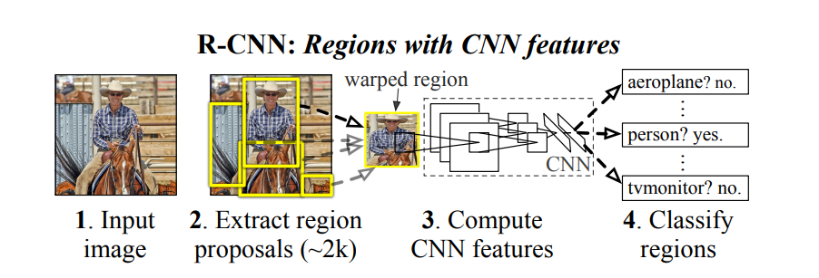
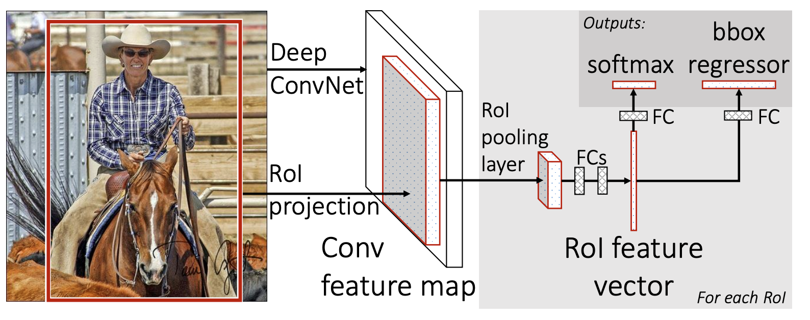
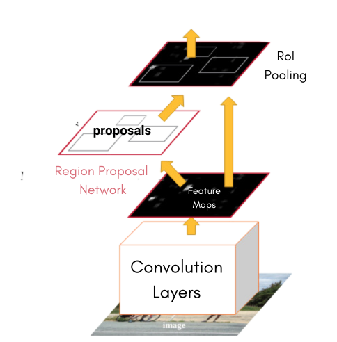

# YOLO

### A short introduction to Object Detection

Object detection requires categorizing the object from the image + predicting its location (coordinates of the bounding boxes of the object).

### RCNN, Fast RCNN, Faster RCNN

#### R- CNN (Region-based Convolutional Neural Networks)
RCNN basic idea is to detect a “region” and then use CNN to classify the region (multi-step process).

The RCNN uses following steps:
1. Use Selective Search algorithm to select a region.
2. Use CNN based classifier to classify an object from the region.

For training purpose, the paper proposed the following steps
1. Make a dataset of regions detected from the Object detection dataset.
2. Fine tune Alexnet model on the regions dataset.
3. Then use the fine tuned model on the object detection dataset.

Basic pipeline of RCNN:

#### Fast RCNN
Fast RCNN is focused on improvisation over the original RCNN. Improvements:
- Training in a single-stage instead of multi-stage like RCNN. Uses multi-task loss
- No disk storage required.
- Introduces ROI pooling layer to only get the features from the Region of Interests.
- Trains an end-to-end model in contrary to multi-step RCNN / SPPnet models using multi-task loss.

#### Faster RCNN
The Faster R-CNN completely removes the need for the Selective Search algorithm (inference time improvement by 90% compared to that of Fast R-CNN!!)

- It introduces RPN, Regional Proposal Network. The RPN is an attention based model which trains the model to give “attention” to the region of the image containing the object.
- It merges RPN with Fast RCNN, making it an End-to-End object detection model.

#### Feature Pyramid Network (FPN)
- A Feature Pyramid network is a kind of Inception model for Object detection.
- It first downscales the image into lower dimensional embeddings.
- Then it upscalses them again.
- rom every upscaled images it tries to predict the output (in this case the categories.)
- But there are also skip connections between the similar dimensional features as well!

### YOLO architecture

#### Before YOLO
The detection systems before consisted of utilizing image classifiers on patches of images. 
Systems like deformable parts models (DPM) used a sliding window approach where the classifier is run at evenly spaced locations over the entire image.
Other works like RCNN used a two-step detection: regions detection by a Region Proposal Network + classification. Post-processing (refining bounding boxes, eliminating duplicate detections...) needs to be done.

These complex pipelines are slow and hard to optimise because each individual component must be trained separately.

#### YOLO
YOLO is a single step detector where the bounding box and the class of the object is predicted in the same pass, simultaneously. This makes the system super fast - 45-frames-per-second fast.

##### Reframing Object Detection
YOLO reframes the Object Detection task as a single regression problem, which predicts bounding box coordinates and class probabilities.

In this design, we divide the image into an S*S grid. If the center of the object falls into a grid cell, that grid cell is responsible to detect that object. We can define B as the maximum number of objects to be detected in each cell. So each grid cell predicts B bounding boxes including confidence scores for each box.

##### Confidence
The confidence score of a bounding box should reflect how accurately the box was predicted. It should be close to the IOU (Intersection over Union) of the ground truth box versus the predicted box. If the grid was not supposed to predict a box, then it should be zero. So this should encode the probability of the center of the box being present in the grid and the correctness of the bounding box.

Formally, confidence:
​

##### Coordinates
The coordinates of a bounding box are encoded in 4 numbers (x, y, w, h). The (x, y) coordinates represent the center of the box relative to the bounds of the grid cell. The width and height are normalized to image dimensions.

##### Class
The class probabilities is a C long vector representing conditional class probabilities of each class given an object existed in a cell. Each grid cell only predicts one vector, i.e a single class will be assigned to each grid cell and so all the B bounding boxes predicted by that grid cell will have the same class.

Formally,

At test time, we multiply the conditional class probabilities and the individual box confidence predictions, which gives us class-specific confidence scores for each box. These scores encode both the probability of that class appearing in the box and how well the predicted box fits the object.

To recap, we have an image, divided into S\*S grid. Each grid cell contains B bounding boxes consisting of 5 values - confidence + 4 coordinates and C long vector containing conditional probabilities of each class. So, each grid cell is a B\*5 + C long vector. The whole grid is S\*S (B\*5 + C).

So if we have a learnable system which converts an image to an S\*S (B\*5 + C) feature map, we are one step closer to the task.

##### Network Architecture
In the original YOLOv1 design the input is an RGB image of size 448*448. The image is divided into a S*S = 7*7 grid, where each grid cell is responsible for detecting B=2 bounding boxes and C=20 classes.

The network architecture is a simple CNN. The input image is passed through a series of convolutional layers, followed by a FC layer. The final layer outputs are reshaped to 7*7 * (2 * 5 + 20) = 7*7 * 30.

The YOLOv1 (inspired by GoogLeNet, which used 1x1 convolutions to reduce the depth of the feature maps). This was done to reduce the number of parameters and the amount of computation in the network. The network has 24 convolutional layers followed by 2 fully connected layers. It uses a linear activation function for the final layer, and all other layers use the leaky ReLu:

##### Training
The network is trained end-to-end on the image and the ground truth bounding boxes. The loss function is a sum of squared error loss. The loss function is designed to penalize the network for incorrect predictions of bounding box coordinates, confidence and class probabilities. 

YOLO predicts multiple bounding boxes per grid cell. At training time, we only want one bounding box predictor to be responsible for each object. We assign one predictor to be “responsible” for predicting an object based on which prediction has the highest current IOU with the ground truth. This leads to specialization between the bounding box predictors. Each predictor gets better at predicting certain sizes, aspect ratios, or classes of objects, improving overall recall. We will encode this information in the loss function for grid cell $i$ and bounding box $b$ using $\mathbb{1}{ib}^{\text{obj}}$. $\mathbb{1}{ib}^{\text{noobj}}$ is the opposite of $\mathbb{1}_{ib}^{\text{obj}}$.

